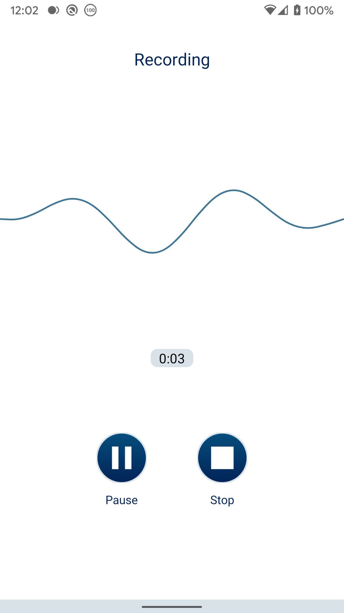
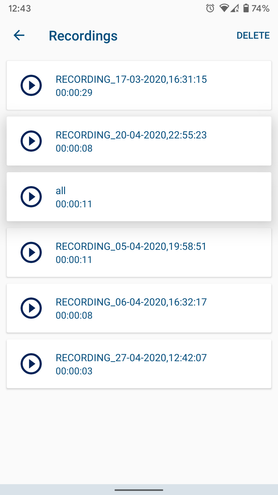
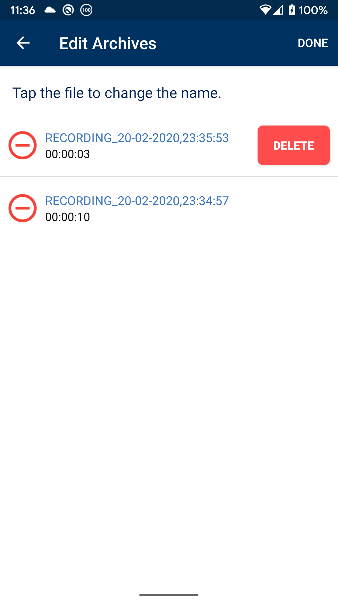

# Recording

A simple android voice recording application I created a while back. It has following features;
1. Record voice.
2. Pause/Resume between a recording
3. Save recording to local storage in a folder named Recording.
4. View all recordings.
5. Rename or delete a recording.

## Screenshot

